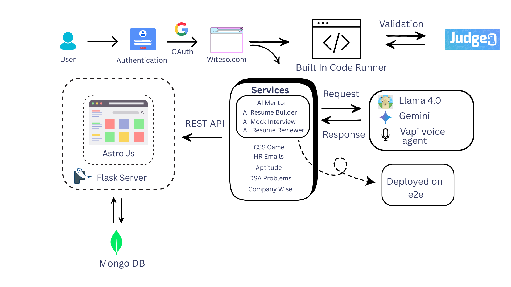
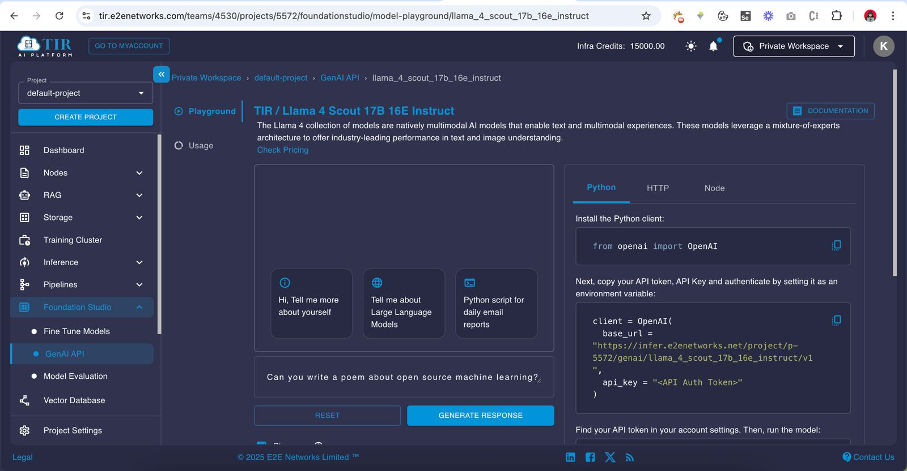

# Witeso

Witeso is an all-in-one upskilling platform designed to empower users by providing a comprehensive suite of tools and learning modules to master technical and non-technical skills. Whether you're preparing for technical interviews, improving your coding skills, or honing your web development abilities, Witeso offers everything you need in one centralized platform.

🔗 *Visit this url to interact with our website :* [witeso.com](https://witeso.com)

---
## 🎥 Demonstration of the Project

Watch a full walkthrough of the Witeso platform on YouTube:  
[](https://www.youtube.com/watch?v=yEDYBYsG_9c)

---

## 🌍 The Why Behind Witeso

In a small village in Uttar Pradesh, lives Anjali — a 20-year-old girl from a low-income household. Her father’s health doesn't allow him to work anymore, and her younger siblings are still in school. She isn’t dreaming of luxury — she’s dreaming of survival.

Anjali wants to become the first earning member of her family. She’s willing to learn any skill — customer service, data entry, teaching, or anything that can help her get hired. But all she finds online are:

1. Unfinished YouTube tutorials  
2. Irrelevant, overly advanced content  
3. Confusing courses with no clear job path  
4. No mentorship, no mock tests, no feedback  

> _She’s not lazy. She’s just lost and confused._

### 🎯 The Problem We’re Solving

Millions of youth — especially women from small towns and rural areas — want to work. But they’re trapped in a maze of:

- ❌ Unstructured learning  
- ❌ Lack of mentorship  
- ❌ No clarity on job paths  
- ❌ Weak resumes, zero interview prep  
- ❌ No confidence to even apply  

They don’t need motivation — they need direction.

---

## 🌟 What We’re Building — Witeso

Witeso is an AI-powered skilling platform that gives learners everything they need to get skilled and get hired — in one place.

We focus on practical, job-ready skills and real guidance — not just academic theory.

### 🧩 What Witeso Offers:

- ✅ Guided Learning Paths in tech, non-tech, teaching, customer support & more  
- ✅ AI Mentor for personalized roadmaps and doubts  
- ✅ Mock Interviews and Job Role Preparation (SDE, Support, Tutor, Data Entry, etc.)  
- ✅ Resume Builder + AI Reviewer (ATS-friendly)  
- ✅ Gamified Skill Practice + Progress Tracker  
- ✅ Cold Email Generator for reaching HRs  
- ✅ Doubt Solving, Notes, Fun Facts, Flashcards, Editorials  
- ✅ Witeso Card – Shareable skilling proof for social media and recruiters  
- ✅ Portfolio Generator – Showcase your full learning journey  

### 👩‍🎓 Our Target Audience:

- Students from Tier-2/3 colleges  
- Women re-entering or starting careers  
- Youth in financially challenged families  
- Anyone overwhelmed by too many unstructured skilling options  

### 💡 Why Witeso (Not Just ChatGPT or YouTube)?

We currently have 140 active users, both from across India and internationally, who were facing the very challenges we've identified — unstructured learning, lack of mentorship, and no clear job paths. By understanding these issues, we've been able to provide them with a free platform that offers structured learning and personal guidance.

Here’s why Witeso stands out:

- **Personalized Learning Paths:** Unlike GPT, which can only provide information, Witeso customizes the learning journey.  
- **Practical Experience and Feedback:** GPT can answer questions, but Witeso offers mock interviews, skill practice, and real-time feedback.  
- **Job-Ready Preparation:** With features like ATS-friendly resume builders and portfolio generators, Witeso actively prepares users for real employment.

There are no limits to their growth, and Witeso is helping them upskill in a way that feels personal and tailored to their unique needs.

### 💫 Our Vision

> “To empower every Indian — regardless of background — with a guided path to skill, earn, and rise.”

From any village, any home, any college — now anyone can learn and succeed from home.  
**No limits. Just learning. Just rising.**

---

## 📑 Table of Contents

- [Features](#features)
- [Technology Stack](#technology-stack)
- [Installation and Setup](#installation-and-setup)
- [Usage](#usage)
- [Contributing](#contributing)
- [License](#license)
- [Contact](#contact)

---

## 🚀 Features

### Comprehensive Learning and Assessment

- **Company-wise DSA Problems:** Practice data structures and algorithms tailored to company-specific needs.
- **DSA Sheet:** A curated, topic-wise collection of DSA questions.
- **Browser-based Code Runner:** Write and test code directly in the browser.
- **Aptitude Mock Tests:** Simulate real interview test environments.

### Career and Professional Development

- **ATS-friendly Resume Builder**
- **AI-powered Resume Reviewer (using Deepseek LLM)**
- **HR Email Finder & Verifier**
- **Centralized Coding Profile Management**
- **Witeso Card & Shareable Certificates**

### Gamified Learning

- **CSS Games & Challenges:** Learn frontend by playing and building.

---

## 🛠️ Technology Stack

### Backend

- **Flask** – Python framework
- **MongoDB** – NoSQL database
- **Judge0** – Online code execution engine

### Frontend

- **Astro.js** – Modern frontend framework

### Hosting & Auth

- **Vercel** – Frontend hosting
- **Supabase + Google OAuth** – Authentication & user management

### 🤖 AI Integrations

Witeso leverages state-of-the-art AI technologies to provide users with a truly personalized and job-ready upskilling experience:

- **Meta LLaMA Model 4.0** – Powers intelligent resume reviews, generating insightful and role-specific feedback to help users create professional, industry-aligned resumes.
- **Gemini** – Enables smart learning assistance by generating personalized learning paths, answering user queries, and recommending content tailored to individual goals.
- **Vapi (Voice Agent)** – Delivers realistic mock interview simulations through voice-based AI, helping users practice communication, confidence, and real-time problem-solving.
- **E2E Deployment** – All AI features are deployed using an end-to-end infrastructure, ensuring scalability, reliability, and seamless integration across the platform.

These integrations ensure Witeso goes beyond static content — providing mentorship, feedback, and preparation that truly guides learners toward employment.
<div style="display: flex; gap: 10px;">
  
  
  
</div>

---

## 🧪 Installation and Setup

### Prerequisites

- Python 3.7+
- Node.js and npm
- MongoDB (local/cloud)
- Supabase account
- Vercel account

### Clone the Repo

```bash
git clone https://github.com/PriyadarshiIndia/Witeso
cd witeso
```
### Backend Setup
```bash
python -m venv venv
source venv/bin/activate  
pip install -r requirements.txt
```

### Frontend Setup
```bash
cd frontend
npm install
npm run dev
```

